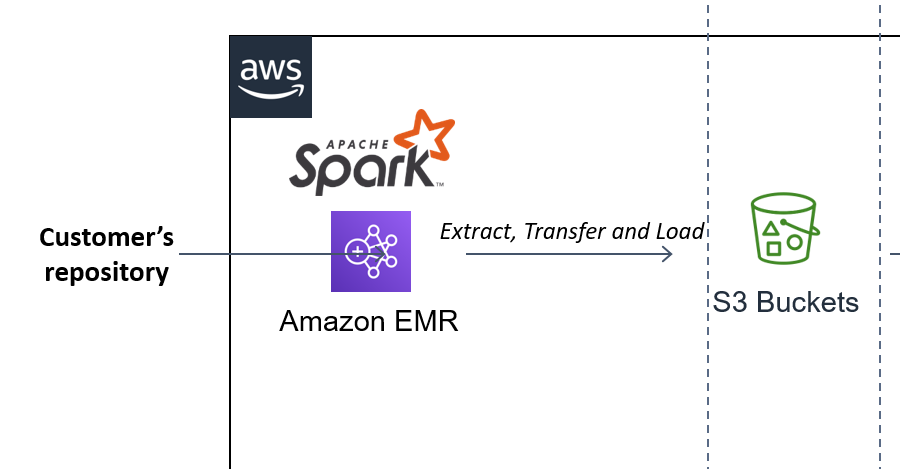

## Step 1: Scope the Project and Gather Data

### The Architecture

The complete solution is cloud based on top of `Amazon Web Services (AWS)`. 

In this project, the datasets are loaded into EMR Cluster, preprocessed with Apache Spark and stored back as Fact and Dimension Tables in AWS S3 bucket in parquet format. The DataQuality checks are performed on the processed data. The Analytics team can pull data into `OLAP datawarehouse` or `BI apps` for their convenient analysis.

The main objective of this project is to develop a ETL pipeline to process huge amounts of source data using `Apache Spark`, store the staging data back to `Amazon S3` bucket (To allow multiple users across the continum to access concurrently), 

Technologies Used: `Python` `Apache Spark` `Amazon S3` 

https://github.com/fpcarneiro/data-engineer-project/blob/master/Capstone%20Project%20Template.ipynb

### Data Source

`I94 Immigration Data`: 
This data comes from the US National Tourism and Trade Office Source. This data records immigration records partitioned by month of every year.

`World temperature Data`
This dataset comes from Kaggle Source. Includes temperature recordings of cities around the world for a period of time

`US City Demographic Data`
This dataset comes from OpenSoft Source. Includes population formation of US states, like race and gender
