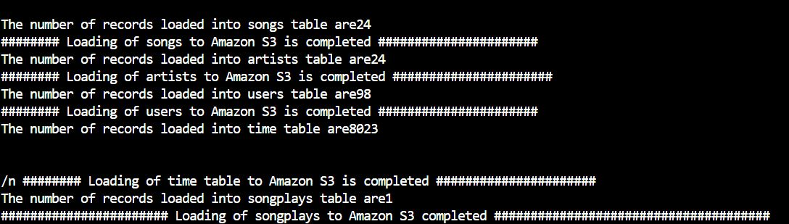

# Introduction
    This project is meant to help the music app Sparkify to move their date warehouse to a data lake.
    It involved 3 steps:
    
1. Extract the data from S3 
2. Processes them using Spark into  set of dimensional tables. 
3. Load them back to S3
    
    This will allow analytics team to find insights in what songs their users are listening to.

# Dataset

    Datasets used were provided in two public S3 buckets as JSON files.
1. One bucket contains info about songs and artists
2. The second has info about actions done by users, which were stored as logs 

# Database Schema

    schema- Star Schema

    This includes 1 Fact table and 4 Dimension tables.

1. Fact Table

songplays - records in event data associated with song plays i.e. records with page NextSong

2. Dimension Tables

users - users in the app
songs - songs in music database
artists - artists in music database
time - timestamps of records in songplays broken down into specific units

# Spark Process

    The ETL job processed the song and log files.
    The song files were used to extract the songs and artists and were stored as parquet data structures.
    The log files are filtered by the NextSong action. 
    The subsequent datasets were then processed to extract the date, time, year etc. fields and records are then 
    appropriately entered into the time, users and songplays as parquet data structures.

# Project Structure

    dl.cfg - Configuration file that contains info about AWS credentials
    etl.py - The ETL to reads data from S3, processes that data using Spark, and writes them to a new S3
