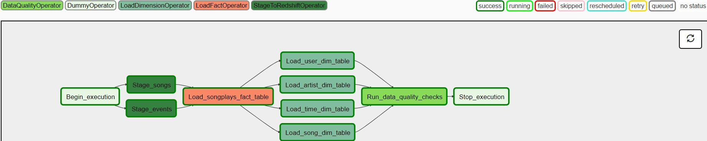
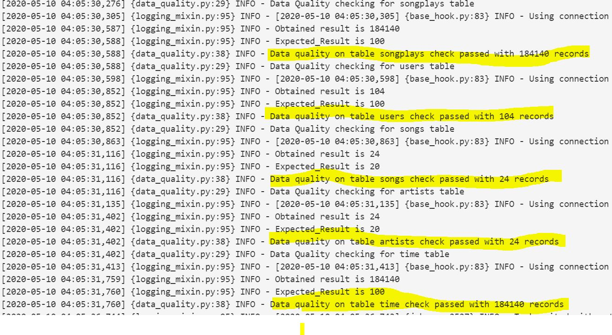

# Data Pipelines with Airflow
A music streaming company, Sparkify, has decided that it is time to introduce more automation and monitoring to their data warehouse ETL pipelines and come to the conclusion that the best tool to achieve this is Apache Airflow.

### Step 1:

Tables must be created in Redshift before executing the DAG workflow. 
The create tables statements can be found in:
 
*script_name : create_tables.sql*

### Step 2:
### Data Sources
Data resides in two directories that contain files in JSON format:

	Log data: s3://udacity-dend/log_data
	Song data: s3://udacity-dend/song_data
    
 *stage_redshift.py* - Operator to read staging files (songs and events) from S3 and load into Redshift staging tables

### Step 3 :

*load_fact.py*- Operator to load the fact table using two staging tables  in Redshift

### Step 4:
*load_dimension.py* - Operator to read from staging tables and load the dimension tables in Redshift

    
### Step 5 :Data Quality Checks
A data quality check was  performed to count the total records each table has. 
If a table has no rows then the workflow will fail;throw an error message.

*data_quality.py* - Operator for data quality checking    

### Main Dag File which contains the flow to run in AirFlow
*udac_example_dag.py* 

